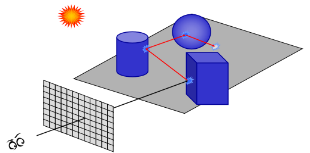
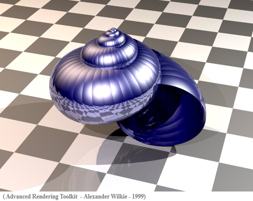
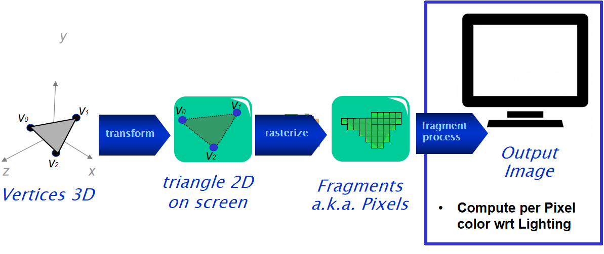

# Computer Graphics

## Week 2 : The Transform Phase

### Recap

1. Ray tracing: Ray tracing is a rendering technique for generating an image by tracing the path of light as pixels in an image plane and simulating the effects of its encounters with virtual objects. Same as ray casting, but bounces multiple times. Easy to compute specular reflections (multiple too) but does not work in real time. The idea is like we shoot a ray from point of view, and whatever we see, we color that pixel, considering the object we see from that point of view. If we have multiple objects we can take consideration of inter-reflection.
   - Black ray : Primary ray
   - Red ray : Reflected ray

<div style="display: flex; justify-content: space-around">
    
    
</div>

2. Rasterization-based pipeline: Also known as Transform and Lighting (T&L)
   

```
// Raytracing
for each pixel
    for each primitive

// Rasterization
for each primitive
    for each pixel
```

