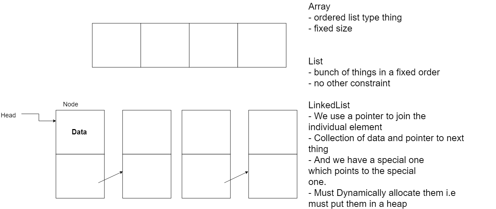

## Lecture 1

### Basic Definations

**Algorithm** : A well defined computational process that takes input and produces an output. Really it's a tool for solving a well specified computational problem.

**Data Structure** : A way to store and organize data. It is just a special type of algorithm.

### Basic C++

**Strings in C++** : Strings in C are just `null` terminated char arrays. (`null` is mostly 0, but since C++11, an actual `null_ptr` type exists.). Where could that possible go wrong? What if you forget the null? What if you want to know the length? C++ has a proper string class (`std:string`) that conceptually wraps a `char[]` and fixes these problems.

**Arrays in C++** : Arrays in C++ look a lot like Java arrays:

- `int a[4] = {1, 2, 3, 4};`
- `int a[] = {1, 2, 3, 4};`
- `int a[4] = {};`
- `int a[4];`

Above examples are statically created. In all the previous array examples, the size was known at declaration. The program does its own memory management – we need to know the size! What if we don’t know the size? _Arrays decay to pointers to the first element_. So, an `int[]` can be treated as a `int*`.

**Static and Dynamic Allocation** : C++ has a more complex allocation system than Java.

- Things can be statically allocated: They are automatically deallocated when they go out scope.
- Or dynamically allocated: Created on the heap with `new` keyword. C++ has no _garbage collection_, so we have to manage it ourself.
- Short, don't use new unless we mean it.

**Pointer** : They're just variables that tell us where something is in memory i.e they point to something.

- To create a pointer to type `t`:
  - `t * foo;`
  - The spaces around the _ doesnot matter. (i.e `t_ foo`or`t * foo`and`t *foo` are all same.)
- A pointer is really just number that is the address of whatever it's pointing at.
- To get what it's pointing at we dereference it:
  - `t bar = *foo;`
  - If we're derefencing to get `(*foo).bar`, we can write the alternative `foo->bar`. This can be nicer in many situation.
- To get the address of something, use the address operator:
  - `int foo = 5; int * bar = &foo;`
- _Arrays as Pointers_: So if we want to create an array where we don't know the size (e.g as a parameter or return type), we need a pointer: `int * tabulate(Data dataObject)...`. But how do we know that we're getting an array? We don't, So, we use `std::vector`.

**References** : They are like pointers, but they cannot change where ther're pointing after initialisation. They're transparent dereferenced.

- They are created with the `&` operator. `int & foo = ...;`.
- But they work like the thing at the other end: `foo = foo + 5;` does what we'd expect.
- References are good for passing data around without copying it.

**Classes**

```c++
#include <string>
using std::string;

class myClass : public parentClass {
  private:
    int privateInt;
  public:
    int getPrivateInt();
    void setPrivateInt(int newValue);
    string toString();
}
```

Notice that the methods have no content there. They can but they don't have to. C++ routinely separates definition from source code. It expects a single pass complier, so we have to have all the names in the right order! Typically definitions are put in _header_ files (`.h` extension). Source code is normally in source files (`.cpp`). Somethimes code is put in the header file. Declare things in the right order for `#include`. Create the equivalent of interfaces (virtual classes).

### A Data Structre

**Abstract Data Types** : ADTs are specification of behaviour of Data Types. They don't specify implementations. Adhereing to an ADT allows us to code without having to know implementation details. (good for teams, reusablility and modularity). In Java, we'd achieve this with an `Interface` and abstraction.

**The List ADT**: A list stores data in sequential order. So, what methods should a list have?

- Something to check if it's empty?
- Something to add to the front of the list?
- Something to add to the end?
- Something to get the first element?
- Something to get the rest of the list?

```c++
class intList {
  public:
    virtual ~intList() {};
    virtual bool isEmpty() = 0;
    virtual void prepend(int c) = 0;
    virtual void append(int c) = 0;
    virtual int head() = 0;
    virtual intList tail() = 0;
}
```

**Lecture1 Demo**

```bash
$ g++ -std=c++17 main.cpp
$ ./a.out
```

```cpp
#include <iostream>

int main() {
  int a[] = {1, 2};
  std::cout << a[1] << ", " << a[2] << std::endl;
}

// prints 2, 4200867

int main() {
  int* a;
  std::cout << a[1] << ", " << a[2] << std::endl;
}
// prints -337956413, -1916565246 or (Segmented fault (core dump))
// It just allowcated some memory to a which has some value in it

int* a = 5; // error: invalid conversion from 'int' to 'int*' [-fpermissive]
// g++ -std=c++17 lecture-1.cpp -fpermissive (for the execution so that it gives above error as simple warning and now we can run it.)
// Gives Segmented fault (something wrong with pointer)

```

```cpp
int main() {
  int foo = 5;
  int* a = &foo;
  int ** b = &a; /* pointer to a pointer, thats how we do 2D arrays */
  std::cout << a << ", " << *a <<  ", " << &a << std::endl;
}

// a is saying in other end there is an int, b is saying at ther other end there is pointer to an int
// Gives 0x61ff0c, 5, 0x61ff08
// a is the memory location and *a is the actual value of memory with dereferencing it. &a is the location of foo.

for (int i = 0; i < 10; ++i) {
  cout << b[i] << endl;
  // we can also add value to the pointer
}
// Square brackets do is it gives us an offset to a base memory address
```

### Lab 1

One of the practical results of this is that C++ allows the programmer significantly more control over precise details of the program's execution, details which are unavailable in Java. This control however comes with the cost that there are many more places to make simple mistakes that produce errors that are, at least initially, baffling.

**Basic Data Types in C++**: C++ has largely the same complement of basic data types that Java does (`primitives` in Java), though sometimes with certain differences in implementation and sometimes with differences in
name.

- `bool`, equivalent to Java's boolean
- `char`, equivalent to Java's `char`
- `short int`, equivalent to Java's `short`
- `int`, equivalent to Java's `int`
- `long int`, equivalent to Java's `long`
- `float`, equivalent to Java's `float`
- `double`, equivalent to Java's `double`

Many of the primitive types in C++ are actually just `int`s of different length - in fact, initially, there was no boolean type, C++ simply used the old convention of 0 being `false`, and 1 being `true`. `short` is in fact a modifier, as is `long`, `signed` and `unsigned`.

**Arrays** : C++ arrays are zero indexed. To declare an array in C++ we write something like:`<type> <name>[<size>] = <initialisation code>`.

```cpp
int foo[5]; //array of ints of size 5
int foo[5] = {1,2,3,4,5};  //explicit single line initialisation
```

**Strings** : `java.lang.String` class in C++ is the `string`. Strings can also be handled in a different manner in C++, as arrays of `chars`. `string` is really a wrapper class around the array of `chars` representation, the key part is that string handles some of the nastier technicalities for us.

```cpp
#include <string> //includes the string class
//whatever other code goes in-between
std::string s = "foo";
```

**Conditional and Loops**:

- `if` statement
  `if (<boolean condition>) { <true branch> }`
- `for`, `while` and `do...while`, with the same syntax as Java. Since the C++11 standard, it also has the same for-each construct as Java:
  `for (<variable setup> : <array>){ <code> }`

**Functions** : A return type, a function name and a list of parameters. The main syntactic difference that we will encounter immediately is that the access modifiers are specified in groups, rather than per data member/function. The second main difference is that functions in C++ do not need to be methods, i.e. they can exist outside an object. In fact, typically the main method of a program is not placed in a class.

- An empty main function (and probably the smallest compilable and runnable program):

  ```cpp
  int main(){}
  ```

  - Note that in C++ the main function returns an int, and does not have to take parameters. If you want to read in command line parameters you would write something like:

  ```cpp
  int main(int argc, char * argv[], <any other parameters>){
    //code
  }
  ```

  - Access modifiers

  ```cpp
  class foo {
    public:
      /*<public data members and functions>*/

    private:
      /*<private things>*/

    protected:
      /*<protected things>*/
  };
  //So the labels are applied to anything that follows them, up until you see a new label
  // the default is private
  // Functions defined outside a class are all public.
  ```

**Standard I/O** : C++ has two basic I/O streams and are equipped with two special operators:

1. `cout` for output (normally the terminal), and `<<` for writing to a stream.
2. `cin` for input (normally the keyboard) and `>>` for reading from a stream.

```cpp
cout << "Hello World";
cout << "Hello" << "World" << "\n";
cout << "Hello";
cout << "World";
cout << "\n";
// reading from cin is similar
int foo;
cin >> foo;
// reading from cin takes whitespace as a break point, to read strings with spaces or linebreaks we need the getline function which takes a stream and a target string as inputs:
string str;
getline(cin, str);
```

**Namespace** : The I/O streams are not automatically included in the build libraries, we need to explicitly add them, much in the same way that if you want to use an `ArrayList` in Java, you would need to include the line import `java.util.ArrayList;` at the beginning of the source file. In C++, this is achieved by the `#include` compiler directive. For example to use strings and cout we would need to write:

```cpp
#include <string>
#include <iostream>
#include "foo.cpp" // If we want to include the contents of other  source files

using namespace std; //If we are using a lot of things from the same namespace, we can use using namespace <namespace name>; at the start of the code to reduce a bit of typing
int main(){
	std::cout << "foo"; //cout is in the namespace std. The :: operator is C++'s scope resolution operator, similar to Java's ., but C++ also has the . operator for accessing methods in the same way Java does.
}
```

- The difference is that using `<...>` tells the compiler to look in the library path (often controlled by a system variable like `CPLUS_INCLUDE_PATH`), whereas `"..."` tells the compiler to look in the working directory (and the path relative to that). C++ uses a concept called _namespaces_ to help organise code and prevent conflicts in large projects. In intent, they are essentially equivalent to Java's packages, but handling them in practice is marginally different.
- `using namespace std;` This is a bit untidy though, co-opting an entire namespace, and it means every class in that namespace is now an identifier in the local namespace, which can cause problems if you happen to give something the same name. If we want to be more precise, but don't want to write namespace:: all the time, we can pick out the individual names we want to use:

  ```cpp
  #include <iostream>
  using std::cout;

  int main(){
    	cout << "foo";
      }
  ```

- We can stack as many of these using commands as we need.

**Compiling C++** :

```bash
# we compile a single file source.cpp from the command line as follows:
> g++ -c source.cpp
# This produces object code, in a file source.o
# When all components of the program have been compiled, they must be linked:
> g++ -o <executable filename> source1.o source2.o ...
# the -c flag tells the compiler to only compile the code to a .o file, and -o tells the compiler the name of the output file, so you can actually compile, for example, all the .cpp files to the default output file a.out as follows
> g++ *.cpp
#  you can still control which version of the C++ standard it compiles to with the -std=.... option:
> g++ -std=c++14 ...
# We will use C++17
```

## Lecture 2

<small>intLinkedList.h</small> : Definition of what gonna be in the class `intLinkedList.cpp`.

```cpp
#ifndef INTLINKEDLIST_H_ //if not defined
#define INTLINKEDLIST_H_ // define
// # -> compiler directive

#include <cstddef>
#include <string>

#include "intList.h"

using std:size_t;
using std:string;

class intLinkedList : public intList { // interface
  private:
    class intNode {  //private inner class
      private:
        intNode * next;
        int data;

      public:
        intNode(); //constructor
        intNode(int Node * next, int data); // constructor
        ~intNode(); // destructor (if we create something in heap we have to delete them)
        int getData(); // accesor
        intNode * getNext();
        void setNext(intNode *); //mutator
    }; // end of node class

  intNode * head;
  size_t length;
  // arent't objects but are types, underneth it is just a unsigned int
  //(tells us regardless of what its name is, this variable is meant to indicate the size of whatever it is attached to, so, size_t is size type)

  public:

    intLinkedList();
    ~intLinkedList();
    bool isEmpty();
    void prepend(int c);
    void append(int c);
    int getHead();
    intLinkedList* tail(); // return type is a pointer to a linklist
};

#endif
```

<small>intList.h</small>: Interface in C++ (bunch of method name). Java uses dynamic light binding, so if we have got `a extend b {}` , then we create a variable of type b and instanciate with a, when we call the method `getHead()` on b, it will actually run the method defined in a. So, it will go to the buttom of hierarchy (inheritance tree) and grab that one. But, C++ will grab the one closest to the starting point. So, `virtual` keyword pushes that down. I.e dont use the one here but go get the one that is actually on the object we are talking about. `virtual int getHead() = 0;` what equals 0 does is that it can have no instantiation here. (In C++ we can do a virtual method that has a implementation).
So, all those says that here is the methods which has to be implemented in the class it inherits from. (Same as java interfaces)

```cpp
#ifndef INTLIST_H_
#define INTLIST_H_

// a list is the thing that implements below things correctly
class intList {
  public:
    // pure virtual function
    virtual ~intList(){};  // must have a destructor
    virtual bool isEmpty() = 0; //
    virtual void prepend(int c) = 0;
    virtual void append(int c) = 0;
    virtual int getHead() = 0;
    virtual intList * tail() = 0;
}
#endif
```

**Linked List**:



This is the source file of our header file (`intLinkedList.h`). All we do here is fill in the gaps.

<small>intLinkedList.cpp</small>

```cpp
#include "intLinkedList.h"

intLinkedList::intNode::intNode() {}
intLinkedList::intNode::intNode(intNode * n, int d){}

intLinkedList::intNode::~intNode(){} //We dont have to do anything for this one

int intLinkedList::intNode::getData(){}
intLinkedList::intNode* intLinkedList::intNode::get(){}

void intLinkedList::intNode::setNext(intNode * n){}

intLinkedList::intLinkedList(){}
intLinkedList::~intLinkedList(){}

bool intLinkedList::isEmpty(){}

void intLinkedList::prepend(int c){}
void intLinkedList::append(int c){}
int intLinkedList::getHead(){}
intLinkedList * intLinkedList::tail(){}
```

**Simple I/O** : C++ has a number of ways to handle basic text input and output. Standard `cin` and `cout`. These are the same idea as Java's `System.in` and `System.out`. But come with special operators: `>>` and `<<`. They are in `iostream` library. `cerr` also exists for errors.

```cpp
#include <iostream>
#include <string>
int main() {
  std::string name;
  std::cout<<"Enter your name: "<<std::endl;
  std::cin>>name;
  getLine(std::cin, name);
  //cin stops at first whitespace so to get whole line use getLine()
}
```

**File I/O**: Uses the same abstraction as cin and cout.

- Use the library `fstream`.
- Create an `ofstream` for writing.
- Create an `ifstream` for reading.

**Destructors** :

- `~intLinkedList()` This is a destructor. This is a special method that's run when an object has the special `delete` operator called on it.
  - Syntax: `delete [pointer to the thing to delete]`.
  - For arrays `delete[] [array varaible]`
  - `delete` is needed when we've created something with `new`. Otherwise, the heap memory is not deallocated, and we have a memory leak. To destroy our computer, create a loop that just allocate memory to an int or vector.

**Exception** : C++ can throw exception, just like Java. C++ can throw anything. (Java has very strict object hierarcy and we can treat everything in Java as object. In C++ there is no single unified hierarcy for Exception). C++ does define a set of exceptions, defined in `<exception>`. Syntax: `try { //... } catch([Exception Type][parameter name]){ //... }`

```cpp
try {
  int c;
  std::cin >> c;
  bool b = true;
  throw b;
} catch (int i) {
  std::cout << i << std::endl;
} catch (bool i) {
  std::cout << b << std::endl;
}
```

**Compling with multiple files** :

```bash
$ g++ -std="c++17" -o test ctest.cpp pointer.cpp
```

**Abstract Data Type**: ADT is a collection of behaviours.

**Queues** : The (basic) Queue is the basic FIFO (first-in-first-out) data structure. It keeps things in order (like a list), but things can only be added to the back, and things can only be taken off the front. The most basic keep things in order and give me as they arrive data structure. Things like all the buffers in computer are implemented in queue become we have to do the processing in the order they arrive but we cannot handle them all at once so we have to do one at a time.

<small>A Pure-ish Virtual class for a Queue of ints</small>

```cpp
class intQueue {
  public:
    virtual ~intQueue(){};
    virtual void enqueue(int n) = 0; //add at the back
    virtual int dequeue() = 0;  // take something off from front
    virtual int peek() = 0;  // look at the front element
};
```


Other types of Queue:

- A Deque is a double-ended queue - we can add and remove at both ends. This is really important for implementing other data structures. (we cannot pull from out from the middle.)
- A Priority Queue is queue, but elements are inserted with a priority, and come out in priority order. System Buffers works in this queue.

**Stack**: A Stack is like a queue, but it's a last in first out (LIFO) data structure. Like a stack of things. Whatever we put in most recently is the first thing we remove. We can add to the "top", and remove from the "top".

```cpp
class intStack{
  public:
    virtual ~intStack(){};
    virtual void push(int n) = 0; //add at the top
    virtual int pop() = 0;  // take something off from top
    virtual int peek() = 0;  // look at the front element
};
```

- Stacks and Queues are two of the most used data structures that do something.
- Buffers of all kinds are Queues (things go in and get processed in order eventually).
- Stacks are built into the programming language we're using - they control how the program functions.
- If we put every thing in stack and tell them all out, we get the same sequence but in the reverse order.
- Queue correspond to Breadth first notion and Stack corespond to Depth first notion. Stack kind of go all the way down to the bottom and back up to the top, so we get things out in reverse order while the Queue preserves the order we put it in.


