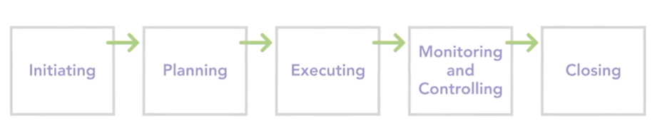
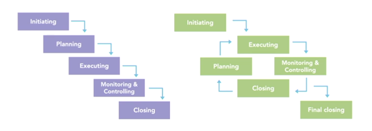

## Getting to Know Project Management

**Components of Project Management**

- _Project_: A project is a temporary endeavour hat has a specific and unique goal, and usually a budget.
  - A project is temporary i.e it has a definite beginning and end. If the project seems to go forever, we haven't clearly defined what we're trying to accomplish.
  - A project produces a unique result i.e each project is unique.
  - Most project has budget. Money, time and resources.
- _Project Management_: Applying our knowledge and skills using various tools and techniques to achieve out project's objectives.
  - What problem are we solving? What the project is supposed to accomplish. "You gotta be very careful if you don't know where you're going, because you might not get there." - Yogi Berra.
  - How are we going to solve this problem? Choose from several possible strategy. Once choosen, flesh out the solution by gathering requirements, identifing deliverables, defining project scope and so on.
  - What's our plan for getting the project done? We need a plan for getting the project done. Details about work to be done, time taken, resources needed and much budget.
  - How will we know when we're done? Clearly defined objectives and requirements help answer this question but we need to define success criteria. Quantifiable, measurable results that show the project is complete. Like a certificate of occupancy for construction, or a project released to market.
  - How well did the project go? What worked well? What didn't work? Why? How could we have done better?
- _Project Manager_:
  - Project manager learns technical skills specific to project management, like what goes into a project plan, how to build and fine-tuned a project schedule, and how to measure performance.
  - As a project manager, its upto him that make sure the project delivers value.
  - Problem solving is the huge part of being a Project Manager.
  - Our job is to figure out how to achieve project objectives and meet the schedule and budget despite the problems that arise.
  - Interpersonal skills: to work with everyone to get the project done and done well.
  - Leadership: Insipe people, guide them , motivate them and hold them accountable.

**Project Life Cycle** : Project Management can be classified into five groups of processes.

1. Initiating: This is all about getting the project commitment to start a project.

   - Define the project.
   - Develop the initial scope.
   - Estimate the cost.
   - Plan resources.
   - Identify project stakeholders.

2. Planning: This is where we figure out the project. When the plan is complete, its time to launch the project.

   - What are we going to do?
   - How are we going to do it?
   - How will we know when we're done?

3. Executing: There is where launch of the project happens.

   - Launch the project.
   - Acquire project team.
   - Develop and manage project team.
   - Explain project guidelines.
   - Executes the plan.

4. Monitoring and Controlling: Whether the project is going according to plan, and if it isn't, we work out ways to get it back on track.

   - Report performance.
   - Control schedule.

5. Closing: Here, we get the client to officially accept that the project is complete.

   - Ensure project acceptance.
   - Document performance.
   - Gather lessons learned.
   - Close contracts.
   - Release resources.

**Traditional vs. iterative project management** :

| Traditional Project Management                                                                                                                         | Iterative Project Management                                                                                                                                                                                                                                           |
| ------------------------------------------------------------------------------------------------------------------------------------------------------ | ---------------------------------------------------------------------------------------------------------------------------------------------------------------------------------------------------------------------------------------------------------------------- |
| When each above process group occurs one after another, it's known as traditional project management                                                   | Iterative and Agile Project Management go through iterations to deliver partial yet production quality solutions at regular intervals.                                                                                                                                 |
| It works well when the project goal and solution are clearly defined and scope and deliverables are clear cut.                                         | We don't know what the solution looks like, so we have to figure it out as we go.                                                                                                                                                                                      |
| The more we know about the project, the better the Waterfall appraoch works. Candidates: Simple, Low risk, familiar technology, experienced resources. | In Iterative, we need increased customer involvement, small independent teams. We then develop detailed plans for each iteration, execution becomes easier because we work on one iteration at a time, moreover, we also monitor and control the project more closely. |

**Organizational structure** has a big influence on how projects are performed, how much a project manager can do, and how easy it is to make projects successful. From the classic functional hierarchy, in which each person reports to only one supervisor, to a matrix, which is part hierarchical and part project-oriented, to a projectized organization, where most of the people work on projects. Each of these structures affects how projects are performed.

- In functional hiearachy, projects are not priority, making it difficult to achieve project success. A functional manager is typically in charge of things like the project budget. Resources are hard to come by.
- Matrix organizations are still functional hierarchies, but they support projects more than pure hierarchies do. In a matrix, project managers have some authority to make decisions. Resources assigned to projects report to two managers, their functional manager and the project manager.
- Projectized organizations are all about projects, making it much easier for project managers to produce results. Project managers have almost complete authority over their projects, including the budget. Resources are dedicated to project work and report to the project manager for the project they're assigned to.

**Organizational culture** is a set of shared values, beliefs, assumptions, habits, language, and other factors that guide people's behaviors and decisions within an organization. All those factors of organizational culture influence how projects are performed and their success.

- The organization's mission and vision shape the organization's culture. Projects that support the company mission are likely to get more attention and resources.
- Leadership and authority are also a big part of organizational culture. If management defines clear goals and then delegates responsibility to employees, that approach works equally well in your projects.
- Another aspect of culture is the organization's work environment. For example, with a positive environment, people are motivated to get things done. And gathering lessons learned is easy because employees are used to providing input and striving to improve.
- Some cultures believe in following the rules. Other cultures nurture innovation, expecting employees to try new approaches, question what's been done before, and come up with better methods. Does your organization put results ahead of procedures? That is, is it better to follow the rules even if you don't achieve the objective? Or can you do whatever it takes as long as you deliver the desired results?
- Change management can be affected by the organization's culture. If the organization is risk averse, the change management process might include multiple rounds of review and require approval from several people. On the other hand, if change is viewed simply as life in the project management world, the change management process is probably a lot simpler.
- In projects with people working in locations around the country or the world, you also need to consider the cultures of your team members.

## Exploring PM Knowledge Areas

**Scope Management**: Project Scope describes the boundaries of a project (included and not included in project). Scope management is manage what is, and is not, included in the project.

1. Scope Management Plan: outlines the processes for defining, validating and controlling scope.
2. Collect Requirements: identifying and documenting project requirements needed to achieve the project objectives.
3. Define Scope: weed out requirements that aren't absolutely necessary. Prepare a _Project Scope_ statement to document what is and isn't included in scope. The project team has to work to deliver the project scope. 
4. We create a _Work Breakdown Structure_, to show our project divided into progressively smaller pieces. Scope Creep in project management refers to changes, continuous or uncontrolled growth in a project's scope, at any point after the project begins. This can occur when the scope of a project is not properly defined, documented, or controlled.
5. Control Scope: Scope has a tendency to expand if you aren't careful, which is why controlling scope is an important part of Scope Management. To prevent Scope Creep, we have to monitor project status and manage change requests.
6. Validate Scope: review completed deliverables to make sure they've been completed satisfactorily.

**Time Management**: Time management to ensure that we complete our project in time.

1. Create a schedule management plan: Document how the project schedule will be developed, managed, executed and controlled.

2. Define schedule activities or task: WBS are called work packages and they identify specific project deliverables. Break down each package into activities that spell out the work needed to complete it.

   

3. Sequence activities: Once you have schedule activities identified, it's time to put them into sequence. The activity sequence is based on the relationships between tasks. When we've added all our activity relationships, the result is a logical sequence of the order in which project work should occur.

   

4. Estimate Resource and durations: Resources we need, including people, equipment, and materials. Then we can use our resource estimates to figure out how long activities will take to finish. 

5. Develop a schedule: Critical path and Critical chain method for scheduling approach.

   

6. Control schedule: monitor progress along with changes to the schedule, so we can spot any deviations from our baseline. 

**Cost Management**: Cost Management. During planning, we put together a cost management plan that spells out how we're going to handle costs in the project. Next, we pull planning info together, like our WBS (Work Breakdown Structure), Schedule, and estimated resources so we can estimate project costs. However, many projects are given a budget to meet. In that case, we may need to juggle scope, resources and schedule until the cost estimate matches the budget. Once work begins on our project, we monitor status and track actual costs.
Estimating Techniques:  (depends on the project and organization)

- Expert Judgement
- Parametric Estimating
- Bottom up estimating

**Quality Management**: 
$$
Project\;success = Meeting\;objective\\Project\;success\ne Exceeding\;objectives
$$
Quality management includes processes to make sure that a project satisfies its objectives and requirements.  In a quality management plan, we identify the quality standards required for the project and deliverables. Things like product specifications, acceptable error rates, and tolerances for physical dimensions. The plan also documents how we'll show that the project meets those standards. Quality assurance is what we do to make sure that our project complies with the quality standards we define. Walk-throughs, reviews, or creating prototypes: we analyse test results to see whether they meet the standards you set. Another aspect of quality assurance is evaluating our quality processes and procedures to see if there are ways to improve. Quality control is testing deliverables and recording the results of those tests. 

**Human Resource Management**: During planning, we identify the skills and roles we need to perform the project work. With those identified, we can build a staffing plan for our project. The next step is to acquire the people we need. Once people are onboard, we have to help the individuals assigned to our project work together and become a team. As work progresses, we manage the team. We track people's performance, provide feedback to help them improve, resolve issues, and manage conflicts.

**Communication Management:** Communication management helps us and everyone else on the project team communicate well. During planning, we develop a plan for communicating on our project. This plan outlines the information we communicate, the audiences who receive information, the methods we use to send it, and how often we stay in touch. Creating, distributing, retrieving,and storing project information, make sure that stakeholders are getting the information they need in the best possible way.

**Risk Management**:  Risks (Events, good or bad that may occur in the future). Not only reduce the probability and impact of negative events, you're ready to take advantage of positive events that occur.

1. Create a risk management plan: Identify how to perform risk management tasks.
2. Identify the risks project could face
3. Analyse risks: analyse the probability that each risk might occur as well as its impact on the project if it does. Prioritize risks
4. Plan risk responses: Avoid, transfer, mitigate, identifying contingencies.
5. Monitor risks: implement the response and track results.

**Procurement Management**: Procurement (Purchasing or acquiring products and services). Managing procurement includes identifying what we need, selecting vendors who provide those items, and managing the contracts we award. 

- The first step in procurement management is to create a plan. In addition to documenting procurement procedures, this plan identifies what we need to get from outside our organization and potential vendors or sellers.
- The next step in procurement is obtaining bids or proposals from vendors or sellers, selecting who we'll use and awarding contracts. While work is underway, we have to manage those contracts, monitor vendor performance, and manage any changes.
- Close procurement