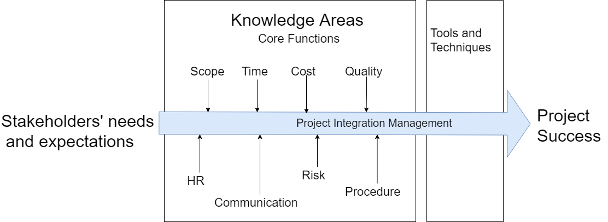
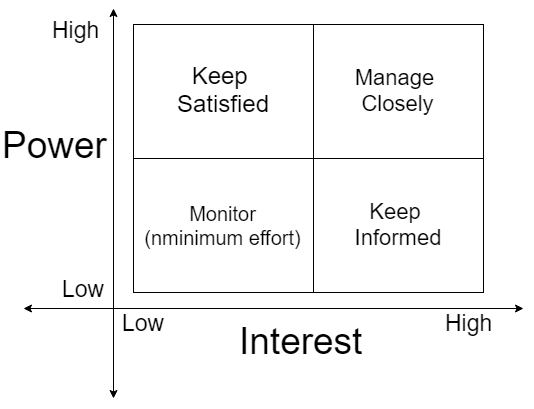
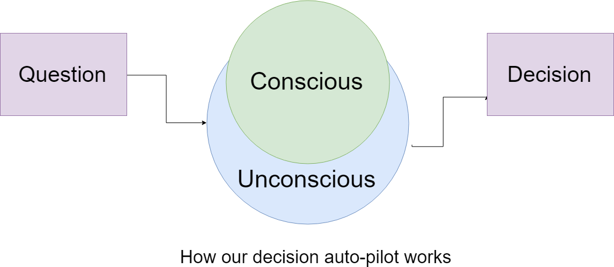
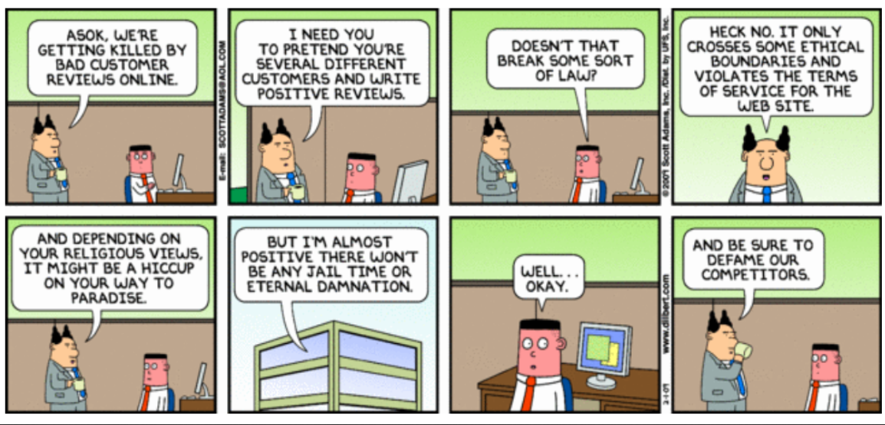

# Project Management

## Week 1

### Module 1 - Introduction

- A Project is a temporary endeavor undertaken to accomplish a unique purpose.
- Project Management is the application of knowledge, skills, tools, and techniques to project activities in order to meet project requirement.
- Why Project Management? Without cureful planning sometimes things just go wrong.

  - Australian Parliament House \$220m to 1100m; 5 months late
  - Sydney Opera House$7m to $103m, 10 years late
  - NSW GovtTcard$35m to $100m; 10 years late, cancel

**Are project management success and project success the same things?**

No! Projects can be a technical success and still be an organisational failure (i.e. a well executed project that doesn’t give the desired benefit).The main difference between Project Success and Project Management Success is that success from a project perspective (Project Success) means that the project resulted in a product or a service that was viable and beneficial to the business. On the other hand, success from a Project Management perspective, means that the Project was on scope, on schedule, and on budget. A Project can be finished on scope, on schedule, and on budget, but still deliver little or no value to the company/stakeholders. On the other hand, a Project can be finished with costs greatly exceeding the original budget, and years after the initial deadline, and yet deliver a great service/product that is beneficial to both the company and the stakeholders (whether internal or external stakeholders). An example of such a project is the Sydney Opera House.

**Project Management Planning**

## Week 2

## Running a Workshop

1. Why? : Industry Processes - common. A neccessary skill for a PM or analyst.Help in understanding stages of a Project. Peer Learning. Demonstrates power of collaborative work. Practice PM techniques

2. What? : Elicit requirements from a group of people with different viewpoints and agendas. Friendly, creative, non conforntational method of getting a diverse group of people to work towards an outcome and agree with said outcome. Outcome is a written document.

3. Who?

   - Facilitator - leads meeting
   - Scribe - takes notes for final report
   - Helpers - helps when breaking into small groups
   - Participants - do the work
   - Observers, tutors - donot participate

4. When? : Normally 3 hours or whole day or several days. We have 45 to 1 hour, takes normally 1 to 2 hours for people to relax and participate fully.

5. Roles

   - Facilitator: States method for this workshops (guidelines). States objectives. States deliverables. Encourages discussion and brainstroming. Elicits contribution from participants. Prepares ideas/issues so can ask questions if needed. Writes ideas clearly and large on whiteboards. Makes it fun. Keeps it moving.
   - Scribe: Listens carefully, takes notes for the later report/outcomes. Responsible for draft of report.
   - Helpers: Runs smaller groups - if needed. Acts as facilitator. Helps facilitoators.
   - Participants: Prepare beforehand - read, discuss, researches topic. Stays within guidelines for workshops, considers ideas to put forward, adds to ideas put forward.

6. Deliverables: Output is normally a document. Details discussion ideas, outcomes and agreements. Posted for circulation, comment and use. Can be used as input for later workshops.

### Module 2 - Projects, Concepts and Stakeholders

**Why Project Management?** : Successful project management means meeting all three goals (scope, time and cost) and staisfying the project's sponser.

1. Strategic Alignmnet: Project management is important because it ensures what is being delivered, is right, and will deliver real value against the business opportunity.
2. Leadership: Project management is important because it brings leadership and direction to projects.
3. Clear Focus & Objectives: Project management is important because it ensures there’s a proper plan for executing on strategic goals.
4. Realistic Project Planning : Project management is important because it ensures proper expectations are set around what can be delivered, by when, and for how much.
5. Quality Control: Projects management is important because it ensures the quality of whatever is being delivered, consistently hits the mark.
6. Risk Management : Project management is important because it ensures risks are properly managed and mitigated against to avoid becoming issues.
7. Orderly Process: Project management is important because it ensures the right people do the right things, at the right time – it ensures proper project process is followed throughout the project lifecycle.
8. Continuous Oversight: Project management is important because it ensures a project’s progress is tracked and reported properly.
9. Subject Matter Expertise : Project management is important because someone needs to be able to understand if everyone’s doing what they should.
10. Managing and Learning from Success and Failure : Project management is important because it learns from the successes and failures of the past.

**Role of the Project Manager**: The Project Manager must:

- Recognise different interests of stakeholders (what’s in it for me?)
- Reconcile competing interests between stakeholders
- Continually communicate with stakeholders
- Ensure a continuing commitment from stakeholders
  How these are done depends on type of project plus the people involved!

**Project Success Criteria** : Project success criteria are the standards by which the project will be judged at the end to decide whether or not it has been successful in the eyes of the stakeholders. In other words, the project success factors consist of activities or elements that are required to ensure successful completion of the project. A successful project:

- Delivers its functionality.
- Meets quality thresholds.
- Achieves its stated business purpose and objectives.
- Finishes on budget, on time and to requirements.
- Key stakeholders are happy with project outcomes.

**Top Ten Factors of Project Success**

1. Executive Management Support
2. Emotional Maturity
3. User Involvement
4. Optimisation (scope vs business value)
5. Skilled Resources
6. Standard Architecture
7. Agile Process
8. Modest Execution
9. Project Management Expertise
10. Clear Business Objectives

**Project Life Cycle** : Project Management can be classified into five groups of processes.

1. Initiating: This is all about getting the project commitment to start a project.

   - Define the project.
   - Develop the initial scope.
   - Estimate the cost.
   - Plan resources.
   - Identify project stakeholders.

2. Planning: This is where we figure out the project. When the plan is complete, its time to launch the project.

   - What are we going to do?
   - How are we going to do it?
   - How will we know when we're done?

3. Executing: There is where launch of the project happens.

   - Launch the project.
   - Acquire project team.
   - Develop and manage project team.
   - Explain project guidelines.
   - Executes the plan.

4. Monitoring and Controlling: Whether the project is going according to plan, and if it isn't, we work out ways to get it back on track.

   - Report performance.
   - Control schedule.

5. Closing: Here, we get the client to officially accept that the project is complete.

   - Ensure project acceptance.
   - Document performance.
   - Gather lessons learned.
   - Close contracts.
   - Release resources.

#### Stakeholders Management

Individuals, groups or organizations with a stake/claim in project's outcome. Not all stakeholders have the same objectives. Diffirent types of stakeholders:

- Internal to the project team
- Extenal to the project team but in the organization
- External to the organization.

**Stakeholder Analysis**:

1. Checklist:
   - Develop list of stakeholders with interest in the project.
   - Identify their type of interest in project
   - Guage their influence over project
   - Define a role for each stakeholder
   - Identify an objective for each stakeholder
   - Identify strategies for each stakeholder
   - Decide communication needs for each stakeholder
2. Stakeholder Analysis Cart: Used for identification, assessment and high level management of involved parties.
   | Stakeholder | Interest | Influence | Role | Objective | Strategy |
   | ----------- | -------- | --------- | ---- | --------- | -------- |

3. Stakeholder Prioritisation: _The power/interest grid_

   

   

   

#### Communication Management

A key skill for the PMs. A priority for both the PM and the team. Nobody likes surprises in project. PMs must identify problems, challenges and issues early and communicate this along with the alternatives to overcome the problems, challenges and issues. Stakeholders need to know _Communication Management A lack of communication willlead to incorrect assumptions!_.

**Communication Planning**

1. How will the information be stored?
2. What info goes to whom, how often and how?
3. Who can access the information?
4. Who will update/keep current information?
5. What method/media of communication is best?

**Performance Reporting to Stakeholders**: Right information to right people in the right format.Satisfy stakeholders that progress expectations are being met. Help stakeholders make educated decisions regarding the project.

So detailed stakeholder analysis is prerequisite to good communications planning/management.

**Communications Management Plan – Sample Matrix**

| Receiving Stakeholder | Report Required       | Time Due         | Producer Name   | Delivery Format   |
| --------------------- | --------------------- | ---------------- | --------------- | ----------------- |
| Steering Commitee     | Weekly status report  | Wednesday 9am    | G.Mooney (PM)   | Hardcopy, meeting |
| Sponsor               | Monthly status report | 1st of month 2pm | G.Mooney (PM)   | Hardcopy, meeting |
| Project Team          | Weekly status report  | Tuesdays 9am     | J.Smith (Admin) | Stand-up meeting  |

_Is stakeholder engagementthe same as stakeholder management?_

- Engagement seeks to build rapport/understanding between stakeholders as a basis for common decision making (= relationship);
- Managementseeks to establish specificdeliverables and expectations then actively plans/executes towards those outcomes (= realisation)

### Questions and Answers

1. What is meant when something is called ‘a project’?

   - A project is temporary in that it has a defined beginning and end in time, and therefore defined scope and resources. And a project is unique in that it is not a routine operation, but a specific set of operations designed to accomplish a singular goal. The development of software for an improved business process, the construction of a building or bridge, the relief effort after a natural disaster, the expansion of sales into a new geographic market — all are projects. And all must be expertly managed to deliver the on-time, on-budget results, learning and integration that organizations need.

2. Why is ‘project management’ important?

   - Project management is important because
     - It ensures what is being delivered, is right, and will deliver real value against the business opportunity.
     - It brings leadership and direction to projects.
     - It ensures there’s a proper plan for executing on strategic goals.
     - It ensures proper expectations are set around what can be delivered, by when, and for how much.
     - It ensures the quality of whatever is being delivered, consistently hits the mark.
     - It ensures risks are properly managed and mitigated against to avoid becoming issues.
     - It ensures the right people do the right things, at the right time – it ensures proper project process is followed throughout the project lifecycle.
     - It ensures a project’s progress is tracked and reported properly.

3. Explain why the ‘triple constraint’ is important to project management.

   - In order to determine if we have achieved the project objective, we need good methods of measurement. If we measure the wrong things, then our focus and attention will be diverted away from the important. So, triple constrainst is a model of the constraints inherent in managing a project. Basically, the Triple Constraint states that the success of the project is impacted by its budget, deadlines and features.

   1. Cost: The financial constraints of a project, also known as the project budget.
   2. Scope: The tasks required to fulfill the project’s goals.
   3. Time: The schedule for the project to reach completion.

   The Triple Constraint is important because it provides a framework that everyone in the project can agree on and drive the project forward while allowing for adjustments as needed when issues arise. The Triple Constraint is a model that helps managers know what trade-offs are going to work and what impact they’ll have on other aspects of the project.

4. Explain the difference between a failed project, a challenged project, a cancelled project and a successful project.

   - With respect to scope, goals, objectives, schedule and budget, there are three ways a project can come to completion:

   1. Successfully – Meaning that the scope, goals, and objectives were met, the project was completed on time, and the project came in at or under budget.
   2. Challenged – Meaning that at least one of the four conditions was not met – either the project was over budget, or it took longer than expected, or the scope, goals, and objectives were somehow compromised.
   3. Failed – A failed project is one that was either given up on or canceled.

5. Describe the difference between ‘project success’ and ‘project management success’.

   - Projects can be a technical success and still be an organisational failure (i.e. a well executed project that doesn’t give the desired benefit).The main difference between Project Success and Project Management Success is that success from a project perspective (Project Success) means that the project resulted in a product or a service that was viable and beneficial to the business. On the other hand, success from a Project Management perspective, means that the Project was on scope, on schedule, and on budget. A Project can be finished on scope, on schedule, and on budget, but still deliver little or no value to the company/stakeholders. On the other hand, a Project can be finished with costs greatly exceeding the original budget, and years after the initial deadline, and yet deliver a great service/product that is beneficial to both the company and the stakeholders (whether internal or external stakeholders). An example of such a project is the Sydney Opera House.

6. Of 5 phases of a typical project life cycle (PLC), explain the value of ‘project closure’.

   - In 'Project Closure', we get the client to officially accept that the project is complete. Ensure project acceptance. Document performance. Gather lessons learned. Close contracts. Release resources.

7. Explain ‘project integration’ within the context of the 10 PM knowledge areas.

   - Project integration management is a way of making various processes work together. Meaning, it takes the numerous processes that are being used in a project and makes sure that they’re coordinated. This includes coordinating tasks, resources, stakeholders, and any other project elements, in addition to managing conflicts between different aspects of a project, making trade-offs between competing requests and evaluating resources. One example would be if a project is not on track, we may need to decide between going over budget or finishing the project late in order to complete it. Assessing the situation and making the decision is a key part of project integration management. Integrated project management helps ensure projects are not managed in isolation. It takes into account not only how aspects of our project relate to each other but also how other parts of the organization relate to your project.

8. Why is having a stakeholder analysis chart important to the project manager?

   - Stakeholder Analysis is an important technique for stakeholder identification & analyzing their needs. It is used to identify all key (primary and secondary) stakeholders who have a vested interest in the issues with which the project is concerned.

   1. A stakeholder analysis can help a project to identify the interests of all stakeholders, who may affect or be affected by the project, key people for information distribution during executing phase and groups that should be encouraged to participate in different stages of the project.
   2. Communication planning & stakeholder management strategy during project planning phase
   3. Ways to reduce potential negative impacts & manage negative stakeholders

9. Explain 2 reasons why good communication skills are needed by project managers.
   - Relaying information : As a project manager, we need to ensure that the team members and the stakeholders are informed of what we expect of them – their roles and responsibilities and other time constraints that prevent them from accomplishing the task on time. As the project manager, it is also our task to keep them informed of project details and progress.
   - Receiving information : In order to relay information, it is a must that project managers regularly access the information for a given project. At any time, there may be stakeholders who need information about the project such as the objectives, plan, risks, customer needs, and time constraints. Adherence to a system of regular and focused communication can prevent misunderstandings and delays that can cause failure in any project.
   - Discussing problems: One can also discuss other topics through infographics, linear/bar graphs, pie chart, comics, etc. There have been various forms of communicating one’s message and the more that we need to develop effective communication skills.
10. In Communication Management there are at least 5 questions that should initially be considered. Why these five?

    - How will the information be stored?
    - What info goes to whom, how often and how?
    - Who can access the information?
    - Who will update/keep current the information?
    - What method/media of communication is best?

11. Why is a Communication Management matrix more valuable after doing a Stakeholder matrix?
    - The communication matrix is an assessment tool designed to pinpoint exactly how an individual is communicating and to provide a framework for determining logical communication goals. It allows you to think through how to communicate most efficiently and effectively to the various constituents. Communication Management matrix more valuable after doing a Stakeholder matrix because:
    1. It helps to determine the Communication Needs of Each Stakeholder.
    2. Determine How to Fulfill the Communication Needs of Each Stakeholder: Communication can take many shapes and forms. In this step, brainstorm how you will fulfill the communication needs for each stakeholder. When possible, look for types of communication that can cover more than one stakeholder’s needs.
    3. Determine the Effort Required : Determine how much effort is required for each of the communication ideas surfaced previously. Some of the activities might be relatively easy to perform. Others will require more effort. If the communication is ongoing, estimate the effort over a one-month period. For instance, a status report might only take one hour to create, but might be needed twice a month. The total effort would be two hours.
    4. Prioritize the Communication Options: Some communication activities provide more value than others. You brainstormed lists of communication options. Now you need to prioritize the items to determine which provide the most value for the least cost. If a communication activity takes a lot of time and provides little or marginal communication value, it should be discarded. If a communication option takes little effort and provides a lot of value, it should be included in the final Communication Matrix. Of course, if a communication activity is mandatory, it should be included no matter what the cost. If a mandatory activity is time consuming, you may be able to negotiate with the stakeholders to find a less-intensive alternative.

### Module 3 - Ethical Foundations and Principles

**IT as a Proffession** :

> Experts in a field, which provides them an advantage over the lay person and that prefessional's work has the potential to impact the general public at large.

**Professional Code of Ethics**

1. Symbolized profession
2. Protect group interest
3. Detail membership etiquette
4. Inspire good conduct
5. Educate members
6. Discipline members
7. FOster external relations
8. Detail principles
9. Express ideals
10. Put forth rules
11. Offer guidelines
12. Codify rights

- Medicine : Hippocratic Oath - AMA
- Law : The Bar - Australian Law Society ALS
- Accountancy : Institute of Engineers Australia, IEA
- Architecture : Royal Australia Institute of Architects
- IT

**Definitions**

- Ethics: Beliefs regarding right and wrong behaviour. Involve moral, legal and social issues. The attempt to determine some general basis for choosing and judging moral actions.
- Ethical behaviour : Behaviour that conforms to generally accepted social norms.
- Ethical Influences : Parent, Family, Boss/Peers/Friends, Schools/Universities, Culture, TV/Media/Internet, Books/Newspaper/Magazines, Government/Law. Virtues and Vices. Value System.

**Ethical Foundations** : Decision-making based on the values we hold.

**Ethical Principles**

| View                      | Description                                                                                                                         |
| ------------------------- | ----------------------------------------------------------------------------------------------------------------------------------- |
| Deontology                | Right and wrong is dependent on meeting a duty and independent of consequences                                                      |
| Consequentialism          | Right/wrong determined by comparative assessment of each act’s consequences (inc _Utilitarianism_ – greatest good, greatest number) |
| Relativism                | There is no single ethical truth, everything is contingency-based (whatever a culture thinks is right or wrong for its member)      |
| Universalism (absolutism) | There is a single thruth - implies a single perspective as to what is right and wrong                                               |
| Virtue ethics             | Focuses on the person who acts - and character traits of the actor as expressed by their actions.                                   |
| Justice ethics            | Duty to treat all parties faily and to distribute risks and benefits equitably (and following rules derived from these principles)  |
| Ethical pluralism         | Society comprises diverse pressure groups with divergent social interests. Stakeholder conflict is normal/accepted.                 |

Projects have consequences:

- [The 73 second flight of Challenger](https://en.wikipedia.org/wiki/Space_Shuttle_Challenger_disaster).
- [The lastflight of Iran Air 655](https://en.wikipedia.org/wiki/Iran_Air_Flight_655).
- [The day Stanislav Petrov saved the world](https://en.wikipedia.org/wiki/Stanislav_Petrov).

Ethical views are founded in individual belief, tend to be deeply held and do not change easily or frequently. An issue is notlikely to be an ethical issue if the individual views which define it are:

- Primarily concerned with convenience
- Founded on opinion, not beliefs
- Casually modified or frequently changed

**Common Ethical Concerns for PMs**

- Deliberate underperformance
- Seeking most lucrative solution (not one making most sense)
- Phoney estimating (not willing to show reasoning)
- Violating confidentiality
- Misinformation, disinformation, falsification and misreporting
- Never willing to stop or put a project on hold•Exaggerating expertise, overselling and low-balling
- Personal interactions/benefits and/or conflicts-of-interest
- Blended billing rates and financial reporting
- Inappropriate mark-up on subcontractors
- Using project management as a sales force

A seven step approach to tackle ethical issues:

1. Get the facts
2. Identify the stakeholders and their position
3. Consider the consequences of your decision
4. Weigh-up various guidelines and principles
5. Develop and evaluate options
6. Review your decision
7. Evaluate the results of your decision

Some general rules of thumb to consider/apply:

- The “Mum” Test
- The Media Test
- The Smell Test
- The “Other Persons’ Shoes” Test
- The Market TestEthical Principles

Having an ethical framework helps provide answers to questions such as:

- What should I (we) do?
- What goals should I (we) pursue?
- What laws should we have?
- What collective behaviour should we pursue?

**Ethics vs Law**

- _Ethics_ in IT must consider how information systems and technology affect human choice, action and potential. Individual beliefs and values
- _Law_ determines principles and regulations in a community set by some authority and enforced by judicial decision. Society rules for accepted behaviour
- Ethical versus Legal: (These are not the same!)
  - Legal and Ethical
  - Ethical but Not Legal
  - Legal but Not Ethical
  - Not Ethical and Not Legal

**Considerations for Information Use**

| Ethical Issues            | Legal Issues           |
| ------------------------- | ---------------------- |
| Growth of knowledge       | Information ownership  |
| Competition               | Monopolies             |
| Personal privacy          | Data tracking / access |
| Protecting the vulnerable | Harassment             |
| Free speech               | Libel                  |
| Openness                  | Espinoage              |
| Fair dealing / fair use   | Copyright /patent / IP |
| Equal opportunity         | Discrimination         |

**Why might ethics be important?**

- Growth in project complexity (more automation)
- Capturing of vast amounts of data
- Reliance on technology to reflect reality
- Law lags behind technology evolution

Decisions/actions we must consider

- Harm minimisatio
- Rights and duties
  - Right to know
  - Right to privacy
  - Right to property
  - Duty to meet obligations
  - Duty to follow the law

We will be put in ethical situations so we need to be able to analyse and decide on the issues.

**Summary**

- One cannot be a Professional unless one has and maintains ethical principles in concordance with the societal and legal framework.
- If one expects ethical behaviour from the other professions then one must maintain ethical behaviour in all IT systems that one is involved with.
- Without ethics one cannot call oneself a Professional.
- Your ethical stance will be tested many times in your career.

[Interesting video lecture on ethics](https://www.youtube.com/watch?v=kBdfcR-8hEY)

#### Questions and Answers

1. What does it mean to be ethical?
2. What is the purpose of an organisation having a professional code of conduct?
3. Describe what it means to be ‘professional’;
4. One potential ethical perspective is called deontology. Describe what is meant by this term and give a specific example to illustrate it.
5. Why do you believe that people may have different ethical views?
6. Give an example of an activity that may be ethical but not legal. Give an example of an activity that may be legal but not ethical.
7. Describe and explain 2 common ethical concerns for project managers.
8. Why is ethics an important issue for the information industry?
9. When tackling an ethical issue (or determining an ethical position) what is the firstthing a person should do?
