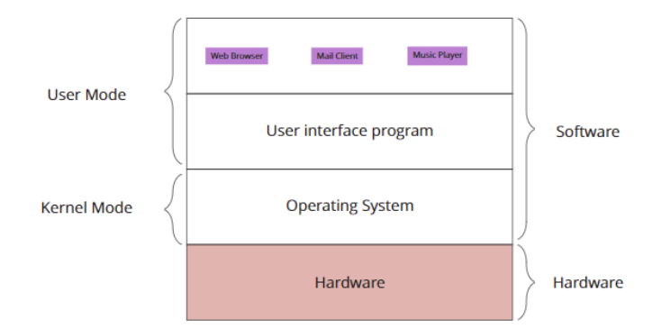

# Lecture 1 - Introduction

### Systems Programming

Programming done to create or support an operating system. Example:

- The OS itself
- Utilities such as editors or grep
- Device Drivers
- UNIX daemons/ Windows Services (ie. programs that respond to requests from other programs)
- Shared Libraries / DLLs

In general programming is classified as either systems programming or application programming.

**Features of System Programming**

- May run continuously
- May involve concurrent processes
- Usually involve system calls
- Are often not started by users
- Have character stream I/O - not users-oriented GUI's
- Usually log actions
- Have to deal with locking and synchronisation
- Often have to share resources

**What a System Comprises** : Generally a system comprises of : Processes, Events, Files, Devices. A system program sees these as data structures maintained by the operaing system. Examples: an event by a UNIX Signal or an interactive window as a `termios` structure.

### Operating System

Where the OS fits?


- It is an extended machine
- Hides the details of the lower level
- Presents user with a virtual machine, easier to comprehend and use.
- It is a resource manager:
  - Each program gets time with the resource.
  - Each program gets space on the resource

**Why have an OS?**

- To provide a more suitable computing environment for applications (easier, safer)
- To make the use of hardware more efficient
- To make the changes in hardware configuration (upgrades, new technologies)
- This implies the ability to evolve, and provide new functionality.

**OS Histroy**

- First generations 1945 - 1955 (vacuum tubes): all programming in machine language, no need for OS
- Second generation, 1955 - 1965 (transistors) : batch systems, jobs batched together, and executed one by one.
- Thrid generation, 1965 - 1980 (ICs and Multiprogramming): time sharing, spooling, multiprogramming
- Fourth generation 1980 - present (LSI and personal computers): GUI interface, multiprocessing, clinet / server, network / distributed OS.

**OS and Hardware**

- OS is a program operating directly on hardware (aka raw hardware)
- OS hides the complexity of hardware i.e provides an abstraction over hardware
  - CPU $\to$ process
  - memory $\to$ virtual address space
  - hard disk $\to$ file system (direction structure, file protection etc)
  - in multi-user environment $\to$ an illusion of being a single user of the system (a virtual machine)

**Processes**

- Are the means by which an OS shares processors
- Are represented by a Process Control Block (PCB)
- Are the entities to which program execution is assigned
- May be grouped into a hierarchy
- Own the resources used by a program. Including:
  - Memory - representated by the page table
  - Thread(s) of execution - representated by program counter
  - Event Handling - representated by signal masks, signal tables
  - others eg. I/O streams

**I/O: Input/Output**

- Processes see I/O as a stream of characters (bytes)
- These streams are set up according to their source/destination eg:
  - A pathname for a file/device
  - An address for another host
- It is the job of the OS to arrange synchronisation with the device
- Applications can specify behaviour of I/O streams eg:
  - To wait or not for data to be available
  - To allow input editing (for terminals)
- Such behaviours are stored in data structures

**File System**

- The file system provides a persistent data storage medium and namespace.
- This namespace is extended to refer to things other than files
- Each name is built up from components
- The physical locations are built from these components
- Physical Details are mostlty hidden by the OS.

**Memory**

**System Calls**

**Unix Systems**

### C Programming Language

**Overview of C**

**C Variables and declaration**

```c
#include <studio.h>
main(){
    int i = 5;
    printf("The value of i is %d\n", i);
    return 0;
}
```

**Data Types**

**C Data Types**
System programming is almost always only uses `char` and `int`.

The `sizeof` operator can be used to determine this: `sizeof(type name)`.

**C Data Constructors**
C has three primitives for more complex data types:

- `enum`:
  ```c
  enum boolean { no, yes}
  /* no = 0 and yes = 1*/
  ```
- `struct`
- `union`
- C also has arrays which are declared implicitly with the subscript operator `[ ]`
  ```c
  int b[30];
  /* says b is an array of 30 ints */
  ```

**Type Conversions**

# Lecture 2

### Enumerated Types

For representing Categorical data. Provide level of abstraction by making coding scheme invisible. Example: (red, amber, green) is closer to the real world than (0, 1, 2)

```c
enum colour {
    red, amber, green
}; // Defines the type enum colou

enum colour indicator; //declares a variable named indicator to be of that type.

// The identifier colour on its own is called a tag. Tags occupy a different name sapce from other objects eg variables, so the declaration below
enum colour colour; // is legal, but not very sensible
```

Enumerations provide a convenient way to associate constant values with names, an alternative to `#define`.

```c
enum months { Jan = 1, Feb, Mar, Apr, May, Jun, Jul, Aug, Sep, Oct, Nov, Dec};
// defines Jan = 1, Feb = 2 ..., Dec = 12 and so on instead of strting from 0 by default.
```

Permitted Operations: `= == != < > <= >=`

Representation: Because enumerated types are represented by intergers, C's weaker typing rules permit integer operations. This may or may not make sense. Ex: `for(indicator=red; inddicator<=green; indicator++)` is interpretable, but an expression like `indicator = indicator * red;` makes no sense at all. In general don't make use of knowledge of representation unless there is no other way to achieve the desired effect.

**Namespace**: Name spaces are a general programming concept. One name can have different meanings within the same scope as long as it occurs in two (or more) different name spaces. In such cases the programming language must provide a means of differentiating each reference to the name. The most immediate example is multiple uses of the same name for different field indentifiers in record structures (`struct`'s in C).

### Pointers
- Are an effective way to represent linked data structures. 
- Provides a higher way 

### Structures in C

### Dynamic Storage

### Functions
